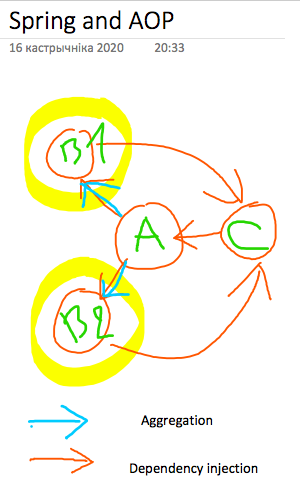

# Getting Started

### Global view
Here is a general concept of this project

### Reference Documentation
For further reference, please consider the following sections:

* [Hooking Into the Spring Bean Lifecycle](https://reflectoring.io/spring-bean-lifecycle/)
* [Official Gradle documentation](https://docs.gradle.org)
* [Spring Boot Gradle Plugin Reference Guide](https://docs.spring.io/spring-boot/docs/2.3.4.RELEASE/gradle-plugin/reference/html/)
* [Create an OCI image](https://docs.spring.io/spring-boot/docs/2.3.4.RELEASE/gradle-plugin/reference/html/#build-image)

### Additional Links
These additional references should also help you:

* [Gradle Build Scans – insights for your project's build](https://scans.gradle.com#gradle)

